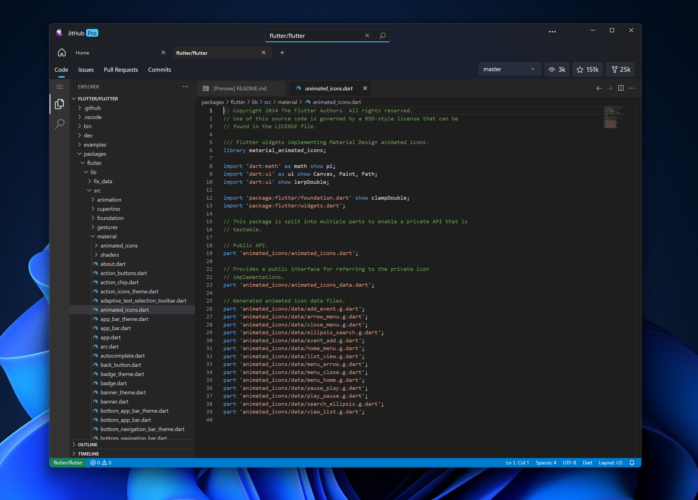
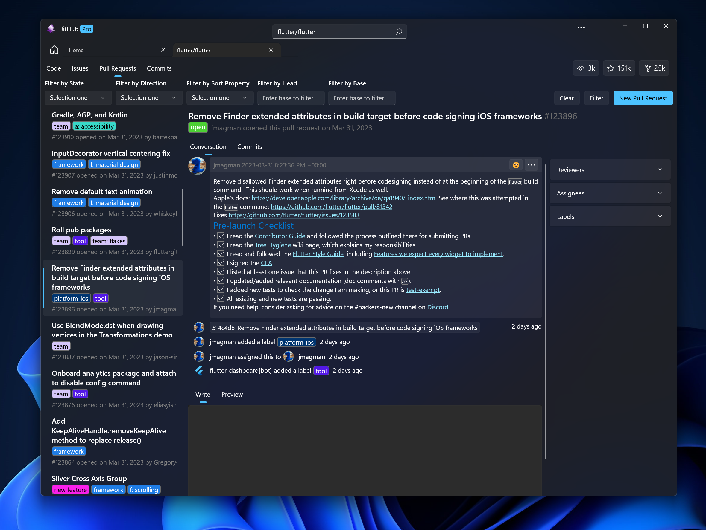

#  JitHub

#### A fast, fluent and free GitHub client for Windows, designed for GitHub lovers 💖 who want a bit of spice with their setup.

<p align="center">
  <a title="GitHub Releases" target="_blank" href="https://github.com/nerocui/JitHubV2/releases">
    
  </a>
  <a title="GitHub Releases" target="_blank" href="https://github.com/nerocui/JitHubV2/releases">
    
  </a>
</p>

<br/>

---

## 🎁 Installation

### 🪟 Microsoft Store
###### ⭐Recommended⭐

<a title="Microsoft Store" href="https://apps.microsoft.com/store/detail/jithub/9MXRBJBB552V">
  
</a>

### 🔨 Build from Source

See [this section](#-building-the-code)

## 📸 Screenshots

###### 🤩 Stunning. Elegant. Redesigned.

<a title="JitHub Screenshot" target="_blank" href="https://github.com/nerocui/JitHubV2">
  
</a>
<br/>
<a title="JitHub Screenshot" target="_blank" href="https://github.com/nerocui/JitHubV2">
  
</a>

######

## 💡 Features

- Browse GitHub repositories by topics, languages, or keywords 🔎
- View repository details, files, commits, issues, pull requests, and actions 📝
- Star, fork, watch, or clone any repository ⭐
- Create, edit, or close issues and pull requests ✅
- Comment on issues and pull requests with Markdown support 🗣️
- Manage your notifications and profile 🔔
- Switch between light and dark themes 🌞🌙

## 🦜 Contributing & Feedback

There are multiple ways to participate in the community:

- Upvote popular feature requests
- [Submit a new feature](https://github.com/nerocui/JitHubV2/pulls)
- [File bugs and feature requests](https://github.com/nerocui/JitHubV2/new/choose).
- Review source [code changes](https://github.com/nerocui/JitHubV2/commits)

JitHub is an open source project and welcomes source code contributions from anyone. If you want to contribute, please follow these steps:
1. Fork this repository and clone it to your local machine. 🍴
2. Create a new branch for your feature or bug fix. 🌿
3. Make your changes and commit them with a descriptive message. 💬
4. Push your branch to your forked repository. 🚀
5. Create a pull request from your branch to this repository's main branch. 🙏
6. Wait for feedback or approval. 👍

Please follow the [code of conduct](CODE_OF_CONDUCT.md) and the [coding style guide](CODING_STYLE.md) when contributing.

### 🏗️ Codebase Structure

```cs
.
├──JitHub                               // JitHub app code (such as code related to UI and GitHub's API)
├──JitHub.VSCode.Client                 // JitHub VSCode implementation
├──JitHub.Controls.Editor               // JitHub file editor
├──JitHub.Services.GitHub.Contributions // JitHub client to obtain user contribution details
├──JitHub.Utilities.SVG                 // JitHub SVG image renderer service
|
├──System.Text.Json.Viewer              // JitHub Json viewer service (for credentials)
├──Utilities.Common                     // JitHub utilities common files
|
├──ScreenShots                          // JitHub screenshots for README and other reference uses.
|
├──Markdig.Client.Markdig               // Markdig markdown viewer files
└──Markdig.UWP                          // Markdig implementation for UWP
```

### 🗃️ Contributors

<a href="https://github.com/nerocui/JitHubV2/graphs/contributors">
  
</a>

## 🔨 Building the Code

### 1️⃣ Prerequisites

Ensure you have following components:

- [Git](https://git-scm.com/)
- [Visual Studio 2022](https://visualstudio.microsoft.com/vs/) with following individual components:
  - Universal Windows Platform Software Development Kit
- [Windows 11 or Windows 10](https://www.microsoft.com/en-us/windows) (version 1809+)
- JitHub is also powered by the following awesome [NuGet](https://nuget.org) packages:
  - Microsoft.UI.Xaml 🎨
  - Octokit 🐙
  - Markdig 📑
  - Html Agility Pack 🕸️
  - Skiasharp ✏️
  - Microsoft.Toolkit.Uwp ⚙️

### 2️⃣ Git

Clone the repository:

```git
git clone https://github.com/nerocui/JitHubV2
```

### 3️⃣ Build the project

- Open `JitHub.sln`.
- Make sure all projects are loaded.
- Create a GitHub OAuth app and put the `client-id` and `secret-key` inside the `secrets.json` file in the `JitHub` project directory.
```json
{
  "Credential": {
    "ClientId": "<your client ID>",
    "ClientSecret": "<your client secret>"
  }
}
```
###### 📝 See the [docs](https://github.com/nerocui/JitHubV2/wiki) on how to create a GitHub OAuth app.

- Set the Startup Project to `JitHub`
- Build with `DEBUG|x64` (or `DEBUG|Any CPU`)

## ⚖️ License

Copyright (c) 2023 nerocui

Licensed under the MIT license as stated in the [LICENSE](LICENSE.md).
