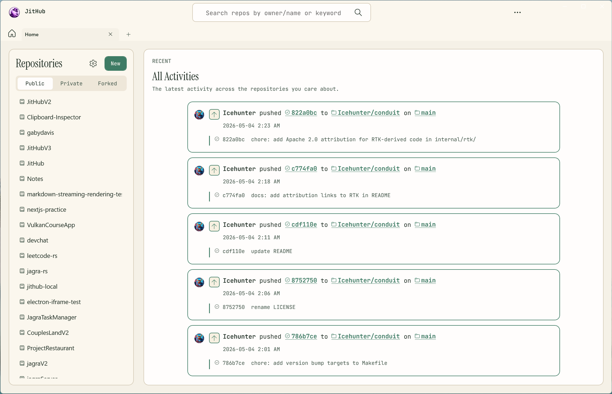
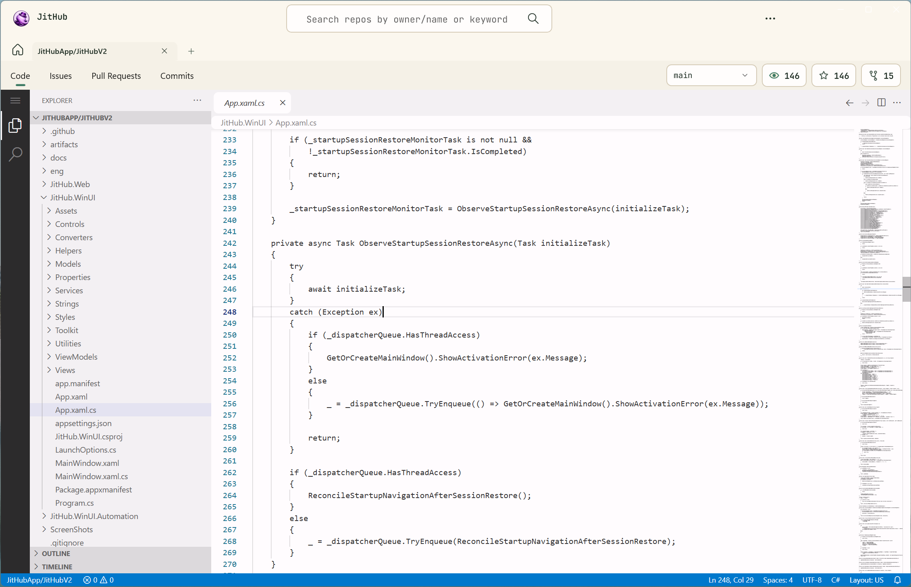
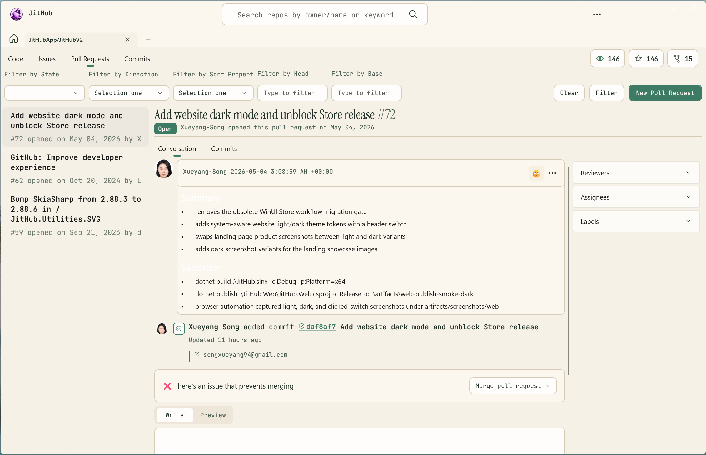

<p align="center">
  <span></span>
  <h1 align="center">JitHub</h1>
</p>

<p align="center">
  JitHub is a packaged Windows App SDK / WinUI 3 GitHub client for Windows. It brings repositories, issues, pull requests, activity, and code browsing into a calmer native desktop app.
</p>

<p align="center">
  <a href="https://apps.microsoft.com/store/detail/jithub/9MXRBJBB552V">
    
  </a>
</p>

## What JitHub Does

- Browse public, private, and forked repositories from a native Windows shell
- Search GitHub repositories and open exact `owner/name` matches quickly
- Read repository activity, issues, pull requests, comments, reactions, labels, and timelines
- Star, fork, watch, create, edit, close, merge, and react without leaving the app
- Browse files, branches, commits, and repository content in an embedded VS Code-based surface
- Use a calm app-owned design system with light and dark themes, design-lab coverage, and screenshot automation

## Screenshots

<picture>
  <source media="(prefers-color-scheme: dark)" srcset="JitHub.Web/wwwroot/ss1-dark.png">
  
</picture>

<picture>
  <source media="(prefers-color-scheme: dark)" srcset="JitHub.Web/wwwroot/ss2-dark.png">
  
</picture>

<picture>
  <source media="(prefers-color-scheme: dark)" srcset="JitHub.Web/wwwroot/ss3-dark.png">
  
</picture>

## Tech Stack

- `.NET 10` with `global.json` pinning SDK `10.0.202`
- Windows App SDK and WinUI 3 for the packaged desktop app
- Native AOT-friendly app services, models, and JSON paths
- ASP.NET Core Blazor Web App with static server rendering for the public website and auth callback host
- Lightweight JavaScript for the browser-to-app authorization handoff
- FlaUI-based UI automation for screenshot proof and smoke checks
- VS Code-derived editor assets generated from the companion `jithub-vs-code` project

## Project Structure

- `JitHub.WinUI`: the desktop app
- `JitHub.Web`: the website, `/authorize` callback page, and `/api/GithubCodeToToken` token-exchange API
- `JitHub.WinUI.Automation`: screenshot and UI smoke-test harness for the app design lab
- `artifacts/EditorAssets/dist`: generated editor assets used by the desktop app; this folder is intentionally not checked in
- `eng`: local helper scripts for editor asset sync, app launch, screenshot capture, and build checks

## Runtime Shape

- The desktop app starts GitHub sign-in in the browser.
- The web callback page exchanges GitHub's temporary code and launches the desktop app through the `jithub://auth/v2` protocol.
- The website is server-rendered by default and does not ship a Blazor WebAssembly runtime.
- The desktop UI is driven by semantic WinUI resource dictionaries and reusable app-owned controls.

## Build From Source

Use the latest Visual Studio 2022 with these workloads:

- .NET desktop development
- Windows application development

You also need:

- .NET 10 SDK
- Node.js
- Yarn

Check optional local Windows CLI helpers with:

```powershell
.\eng\Ensure-WindowsCliTools.ps1
```

Install missing local helpers with:

```powershell
.\eng\Ensure-WindowsCliTools.ps1 -InstallMissing
```

## Local OAuth Setup

Local sign-in uses a GitHub OAuth app that you create in GitHub Developer settings.

Use this callback URL for local development:

```text
https://localhost:7284/authorize
```

The callback route is `/authorize`, not `/auth/callback`. The authorize page calls the same-origin `/api/GithubCodeToToken` endpoint and then launches the app through the `jithub://` protocol callback.

Configure the desktop app with your OAuth app's client ID and callback URL. You can use `JitHub.WinUI/appsettings.json` for local development or override values with these environment variables:

```powershell
$env:JITHUB_OAUTH_CLIENT_ID = "<your GitHub OAuth client ID>"
$env:JITHUB_OAUTH_CALLBACK_URL = "https://localhost:7284/authorize"
```

Configure the web project with the matching OAuth client credentials using your preferred ASP.NET Core configuration source. Keep credentials local to your machine and do not commit them.

## Editor Assets

Build the editor assets from [jithub-vs-code](https://github.com/nerocui/jithub-vs-code) by running `./sync-vscode-assets.ps1` in PowerShell.

The script looks for a local `jithub-vs-code` clone, runs `yarn --frozen-lockfile` and `yarn build`, then copies the generated `dist` output into `artifacts/EditorAssets/dist`. Those generated files are intentionally gitignored.

`JitHub.WinUI` fails to build if `artifacts/EditorAssets/dist/index.html` is missing, and the app loads the copied files directly from `Assets/dist`.

## Local Website Development

Run the website locally with:

```powershell
dotnet run --project .\JitHub.Web\JitHub.Web.csproj --launch-profile https
```

The website does not require `wasm-tools`. The landing page is static SSR, and the authorize flow uses a tiny JavaScript bridge instead of Blazor WebAssembly.

## Running The App Locally

After editor assets are present, open `JitHub.slnx` in Visual Studio and run the packaged `JitHub.WinUI` project.

To build Debug, apply a debug package identity with the Windows App CLI, and launch the app from the terminal, run:

```powershell
.\eng\Start-JitHubWinUIDebug.ps1
```

This builds `JitHub.WinUI` as `Debug|x64`, runs `winapp create-debug-identity` against the built executable, and launches `JitHub.WinUI.exe`.

To launch a different platform or pass app arguments:

```powershell
.\eng\Start-JitHubWinUIDebug.ps1 -Platform ARM64
.\eng\Start-JitHubWinUIDebug.ps1 -AppArguments '--page=design-lab', '--theme=dark'
```

## Design Lab And Screenshot Proof

The desktop app includes a dev-only `DesignLabPage` plus a small UI automation harness for screenshot proof.

Generate the current light/dark screenshot matrix with:

```powershell
.\capture-winui-design.ps1
```

Artifacts are written to:

- `artifacts/screenshots/winui/index.html`
- `artifacts/screenshots/winui/*.png`

The capture script builds `JitHub.WinUI`, launches scenario-specific pages with launch arguments such as `--page=design-lab`, `--scenario=buttons`, and `--theme=dark`, and then uses the `JitHub.WinUI.Automation` project to capture deterministic UI states through FlaUI.

`winapp ui` is also available as a lightweight command-line proof path. Use `./eng/Invoke-WinAppCliSmoke.ps1` for quick launch/wait/screenshot validation; keep the FlaUI design-lab harness for the full deterministic matrix.

## Contributing

1. Fork this repository and clone it locally.
2. Create a branch for your feature or bug fix.
3. Make your changes and commit them with a descriptive message.
4. Push your branch to your fork.
5. Open a pull request against `main`.

Please follow [CODE_OF_CONDUCT.md](CODE_OF_CONDUCT.md) and [CODING_STYLE.md](CODING_STYLE.md).

## License

JitHub is licensed under the MIT License. See [LICENSE](LICENSE) for details.
