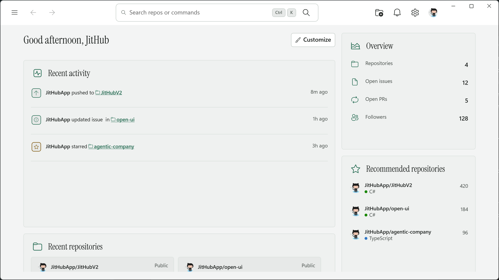
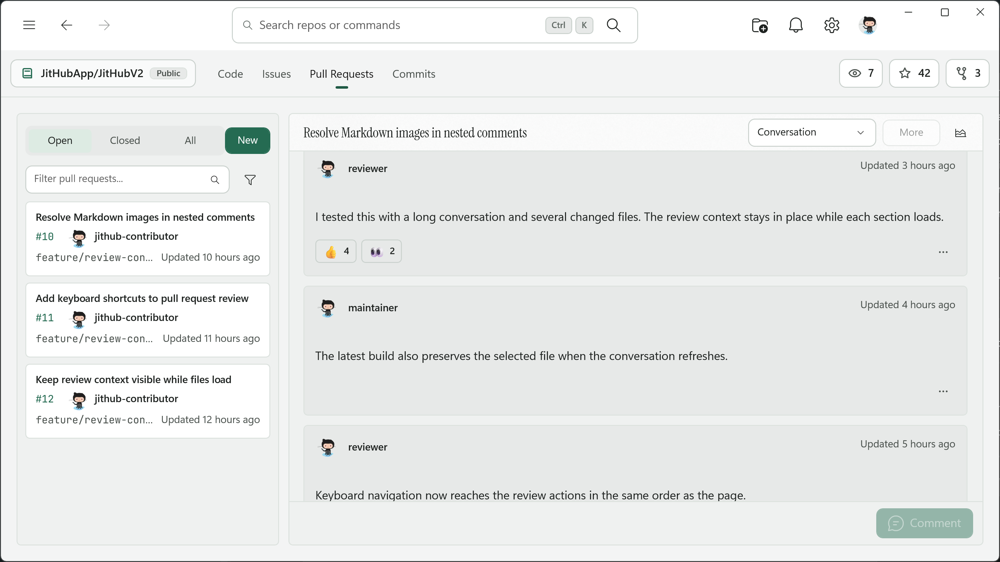
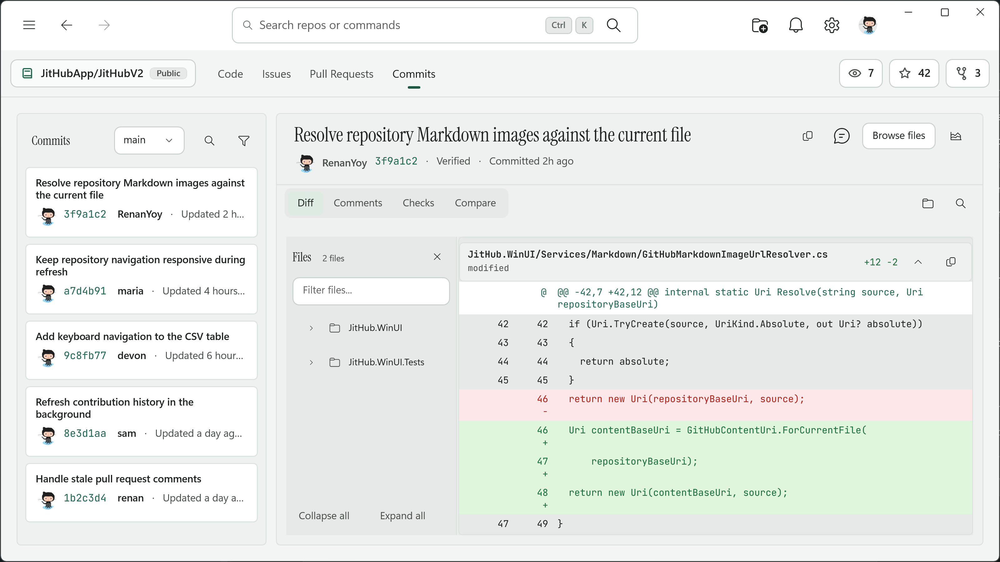

<p align="center">
  <span></span>
  <h1 align="center">JitHub</h1>
</p>

<p align="center">
  JitHub is a native GitHub client for Windows. It brings repositories, issues, pull requests, code, commits, Stars, Gists, profiles, and notifications into one calmer desktop workspace.
</p>

<p align="center">
  <a href="https://apps.microsoft.com/store/detail/jithub/9MXRBJBB552V">
    
  </a>
</p>

## What JitHub Does

- See recent activity, repositories, account overview, and useful shortcuts in a customizable Home workspace
- Work through personal and repository issue and pull request queues with Markdown, reactions, replies, reviews, and merge flows
- Browse branches and files with a native WinUIEdit editor, rich Markdown, secure SVG viewing, and virtualized CSV or TSV tables
- Review commit history with changed-file navigation, virtualized diffs, search, comments, checks, and branch comparison
- Organize Stars, create and edit Gists, inspect profiles and contributions, manage repositories, and triage notifications
- Keep working from cached data when connectivity changes, with keyboard access, High Contrast, and five live color themes in both Light and Dark
- Ship self-contained Native AOT Windows builds for x86, x64, and ARM64 with identifier-free diagnostics

## Screenshots

<picture>
  <source media="(prefers-color-scheme: dark)" srcset="JitHub.Web/wwwroot/media/showcase/home-workspace-dark.png">
  
</picture>

<picture>
  <source media="(prefers-color-scheme: dark)" srcset="JitHub.Web/wwwroot/media/showcase/pull-request-conversation-dark.png">
  
</picture>

<picture>
  <source media="(prefers-color-scheme: dark)" srcset="JitHub.Web/wwwroot/media/showcase/commit-diff-dark.png">
  
</picture>

## Tech Stack

- `.NET 10` with `global.json` pinning SDK `10.0.202`
- Windows App SDK and WinUI 3 for the packaged desktop app
- Self-contained Native AOT Release and Store builds for x86, x64, and ARM64
- ASP.NET Core Blazor Web App with static server rendering for the public website and auth callback host
- Lightweight JavaScript for the browser-to-app authorization handoff
- FlaUI-based UI automation for screenshot proof and smoke checks
- Native WinUIEdit/Scintilla code editing with app-owned tokenized chrome

## Project Structure

- `JitHub.WinUI`: the desktop app
- `JitHub.Web`: the website, `/authorize` callback page, and short-lived OAuth handoff APIs
- `JitHub.WinUI.Automation`: screenshot and UI smoke-test harness for the app design lab
- `MarkdownRenderer`: native WinUI markdown renderer library, documented in [`docs/markdown-renderer`](docs/markdown-renderer/README.md)
- `eng`: local helper scripts for app launch, screenshot capture, packaging, and build checks

## Runtime Shape

- The desktop app starts GitHub sign-in in the browser.
- The web callback page exchanges GitHub's temporary code and launches the desktop app through the `jithub://auth/v2` protocol.
- The website is server-rendered by default and does not ship a Blazor WebAssembly runtime.
- The desktop UI is driven by semantic WinUI resource dictionaries and reusable app-owned controls.

## Build From Source

Use the latest Visual Studio 2022 with these workloads:

- .NET desktop development
- Windows application development

You also need the .NET 10 SDK.

Check optional local Windows CLI helpers with:

```powershell
.\eng\Ensure-WindowsCliTools.ps1
```

Install missing local helpers with:

```powershell
.\eng\Ensure-WindowsCliTools.ps1 -InstallMissing
```

## Local OAuth Setup

Local sign-in uses a GitHub OAuth app that you create in GitHub Developer settings.

Use this callback URL for local development:

```text
https://localhost:7284/authorize
```

The callback route is `/authorize`, not `/auth/callback`. The authorize page exchanges GitHub's temporary code for a short-lived, one-time handoff and launches the app through the `jithub://` protocol callback. The bearer token never enters browser JavaScript or the protocol URI; the app redeems the handoff directly with a verifier stored in Windows Credential Locker.

Configure the desktop app with your OAuth app's client ID and callback URL. You can use `JitHub.WinUI/appsettings.json` for local development or override values with these environment variables:

```powershell
$env:JITHUB_OAUTH_CLIENT_ID = "<your GitHub OAuth client ID>"
$env:JITHUB_OAUTH_CALLBACK_URL = "https://localhost:7284/authorize"
```

Configure the web project with the matching OAuth client credentials using your preferred ASP.NET Core configuration source. Keep credentials local to your machine and do not commit them.

Production web deployments also require a shared Redis connection and a Base64-encoded 32-byte handoff encryption key:

```text
ConnectionStrings__OAuthHandoffRedis=<Redis connection string>
OAuthHandoff__EncryptionKey=<Base64-encoded 32-byte key>
JITHUB_OAUTH_CALLBACK_URL=https://your-jithub-host.example/authorize
```

Redis provides the two-minute distributed TTL and atomic one-time consume semantics across app instances. The encryption key protects GitHub tokens stored in Redis. Production startup fails when either setting is absent; the in-memory backend is limited to the Development environment.
The callback URL is also required in production and is matched exactly before JitHub exchanges an OAuth code. Development accepts the documented local launch callbacks and any additional loopback callback explicitly listed under `GitHubOAuth:DevelopmentCallbackUrls`.

## Native Code Editor

The desktop app uses the native WinUIEdit/Scintilla component through its first-party `CodeEditorControl` wrapper. No web editor bundle or Node.js asset build is required.

## Local Website Development

Run the website locally with:

```powershell
dotnet run --project .\JitHub.Web\JitHub.Web.csproj --launch-profile https
```

The website does not require `wasm-tools`. The landing page is static SSR, and the authorize flow uses a tiny JavaScript bridge instead of Blazor WebAssembly.

## Running The App Locally

Open `JitHub.slnx` in Visual Studio and run the packaged `JitHub.WinUI` project.

To build Debug, apply a debug package identity with the Windows App CLI, and launch the app from the terminal, run:

```powershell
.\eng\Start-JitHubWinUIDebug.ps1
```

This builds `JitHub.WinUI` as `Debug|x64`, removes stale development registrations, registers the dedicated `JitHub.WinUI.Debug` identity, and launches `JitHub.WinUI.exe`. Debug OAuth callbacks use `jithub-dev://`; Store and Release builds remain the sole owners of `jithub://`.

To launch a different platform or pass app arguments:

```powershell
.\eng\Start-JitHubWinUIDebug.ps1 -Platform ARM64
.\eng\Start-JitHubWinUIDebug.ps1 -AppArguments '--page=design-lab', '--theme=dark'
```

Remove stale development identities without launching the app with `eng\Reset-JitHubWinUIDebugIdentity.ps1`. The cleanup is limited to development-mode registrations and preserves the installed Store package.

## Design Lab And Screenshot Proof

The desktop app includes a dev-only `DesignLabPage` plus a small UI automation harness for screenshot proof.

Generate the current light/dark screenshot matrix with:

```powershell
.\capture-winui-design.ps1
```

Artifacts are written to:

- `artifacts/screenshots/winui/index.html`
- `artifacts/screenshots/winui/*.png`

The capture script builds `JitHub.WinUI`, launches scenario-specific pages with launch arguments such as `--page=design-lab`, `--scenario=buttons`, and `--theme=dark`, and then uses the `JitHub.WinUI.Automation` project to capture deterministic UI states through FlaUI.

`winapp ui` is also available as a lightweight command-line proof path. Use `./eng/Invoke-WinAppCliSmoke.ps1` for quick launch/wait/screenshot validation; keep the FlaUI design-lab harness for the full deterministic matrix.

Regenerate the website's paired Light/Dark product media and Home motion clip with:

```powershell
.\eng\Capture-JitHubWebsiteMedia.ps1
```

The `website-showcase` probe uses synthetic public-preview data, blocks outbound networking, captures exact 3200x1800 physical DWM windows with at least a 1200x675 logical workspace, and writes a hash-verified media manifest before updating the tracked website assets.

## Contributing

1. Fork this repository and clone it locally.
2. Create a branch for your feature or bug fix.
3. Make your changes and commit them with a descriptive message.
4. Push your branch to your fork.
5. Open a pull request against `main`.

Please follow [CODE_OF_CONDUCT.md](CODE_OF_CONDUCT.md) and [CODING_STYLE.md](CODING_STYLE.md).

## License

JitHub is licensed under the MIT License. See [LICENSE](LICENSE) for details.
