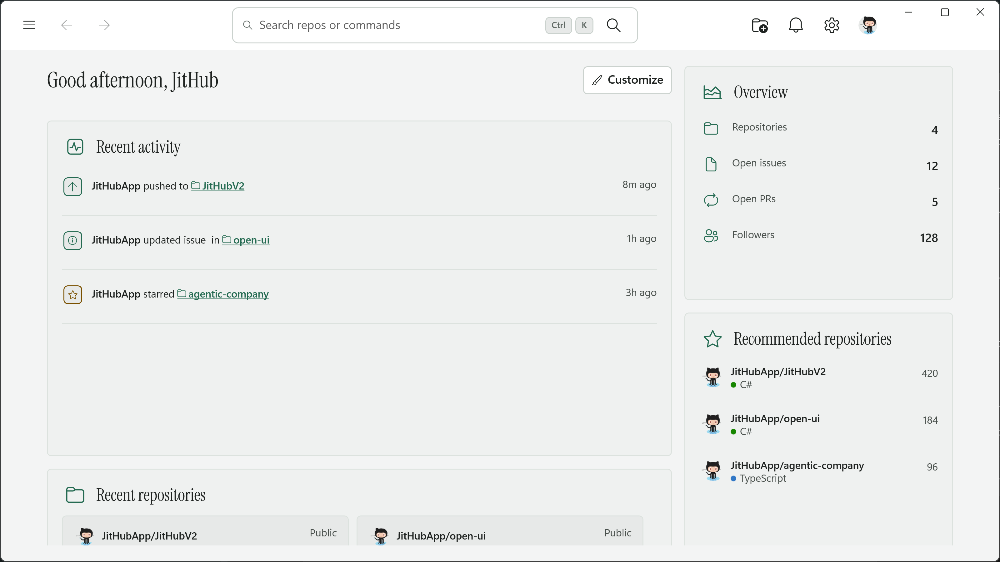
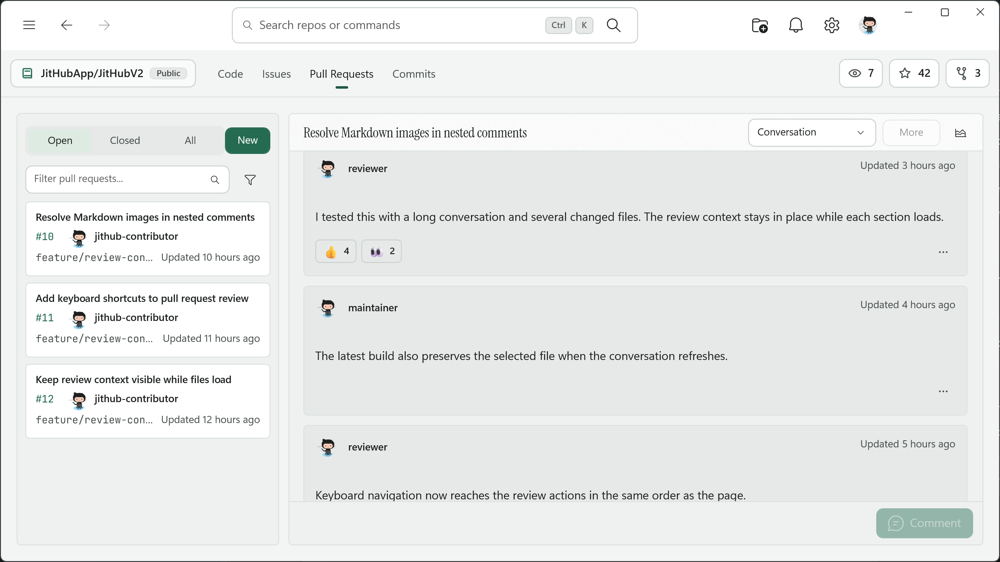
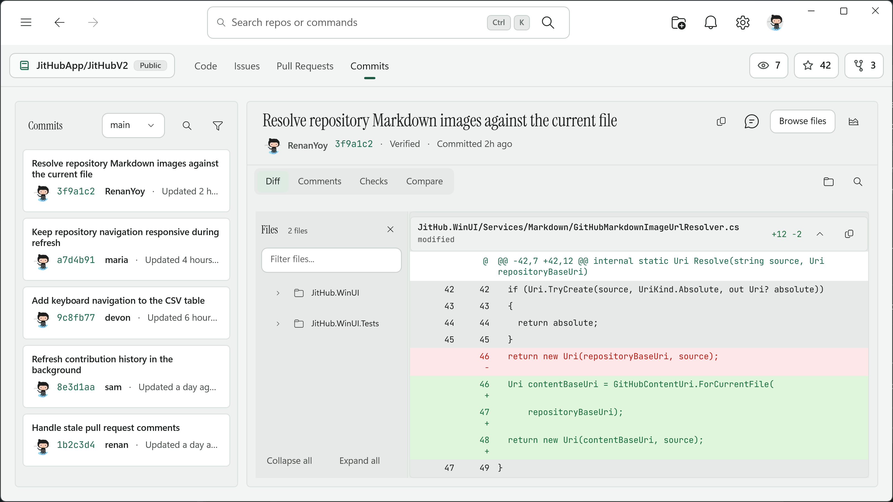

<p align="center">
  <span></span>
  <h1 align="center">JitHub</h1>
</p>

<p align="center">
  JitHub is a native GitHub client for Windows. It brings repositories, issues, pull requests, code, commits, Stars, Gists, profiles, and notifications into one calmer desktop workspace.
</p>

<p align="center">
  <a href="https://apps.microsoft.com/store/detail/jithub/9MXRBJBB552V">
    
  </a>
</p>

## What JitHub Does

- See recent activity, repositories, account overview, and useful shortcuts in a customizable Home workspace
- Work through personal and repository issue and pull request queues with Markdown, reactions, replies, reviews, and merge flows
- Browse branches and files with a native WinUIEdit editor, rich Markdown, secure SVG viewing, and virtualized CSV or TSV tables
- Review commit history with changed-file navigation, virtualized diffs, search, comments, checks, and branch comparison
- Organize Stars, create and edit Gists, inspect profiles and contributions, manage repositories, and triage notifications
- Keep working from cached data when connectivity changes, with keyboard access, High Contrast, and five live color themes in both Light and Dark
- Ship self-contained Native AOT Windows builds for x86, x64, and ARM64 with identifier-free diagnostics

## Screenshots

<picture>
  <source media="(prefers-color-scheme: dark)" srcset="JitHub.Site/public/media/showcase/home-workspace-dark.png">
  
</picture>

<picture>
  <source media="(prefers-color-scheme: dark)" srcset="JitHub.Site/public/media/showcase/pull-request-conversation-dark.png">
  
</picture>

<picture>
  <source media="(prefers-color-scheme: dark)" srcset="JitHub.Site/public/media/showcase/commit-diff-dark.png">
  
</picture>

## Tech Stack

- `.NET 10` with `global.json` pinning SDK `10.0.202`
- Windows App SDK and WinUI 3 for the packaged desktop app
- Self-contained Native AOT Release and Store builds for x86, x64, and ARM64
- React/Vite build-time rendering for the public static website, published through GitHub Pages
- GitHub device authorization in the desktop app, with credentials in Windows Credential Locker
- FlaUI-based UI automation for screenshot proof and smoke checks
- Native WinUIEdit/Scintilla code editing with app-owned tokenized chrome

## Project Structure

- `JitHub.WinUI`: the desktop app
- `JitHub.Site`: the static public website
- `JitHub.Web`: the temporary legacy sign-in host for Store builds released before device sign-in
- `JitHub.WinUI.Automation`: screenshot and UI smoke-test harness for the app design lab
- `MarkdownRenderer`: preview native WinUI markdown renderer with immutable documents and opt-in feature packs, documented in [`docs/markdown-renderer`](docs/markdown-renderer/README.md)
- `eng`: local helper scripts for app launch, screenshot capture, packaging, and build checks

## Runtime Shape

- The desktop app shows a GitHub device code, opens GitHub's verification page, and exchanges the approval directly with GitHub.
- Access and refresh tokens stay in Windows Credential Locker. The static website never handles sign-in.
- Older Store builds still use the temporary legacy sign-in host during the release transition.
- The desktop UI is driven by semantic WinUI resource dictionaries and reusable app-owned controls.

## Build From Source

Use the latest Visual Studio 2022 with these workloads:

- .NET desktop development
- Windows application development

You also need the .NET 10 SDK.

Check optional local Windows CLI helpers with:

```powershell
.\eng\Ensure-WindowsCliTools.ps1
```

Install missing local helpers with:

```powershell
.\eng\Ensure-WindowsCliTools.ps1 -InstallMissing
```

## Local OAuth Setup

Local sign-in uses a GitHub OAuth app with **Enable Device Flow** selected in GitHub Developer settings. Configure the desktop app with that app's public client ID in `JitHub.WinUI/appsettings.json` or override it locally:

```powershell
$env:JITHUB_OAUTH_CLIENT_ID = "<your GitHub OAuth client ID>"
```

Device sign-in does not use a callback URL or client secret. Do not put credentials or tokens in this public repository.

## Native Code Editor

The desktop app uses the native WinUIEdit/Scintilla component through its first-party `CodeEditorControl` wrapper. No web editor bundle or Node.js asset build is required.

## Local Website Development

Build and test the static site locally with Node.js 22:

```text
cd JitHub.Site
npm ci
npm run build
npm test
```

The output in `JitHub.Site/dist` contains only static files.

## Running The App Locally

Open `JitHub.slnx` in Visual Studio and run the packaged `JitHub.WinUI` project.

To build Debug, apply a debug package identity with the Windows App CLI, and launch the app from the terminal, run:

```powershell
.\eng\Start-JitHubWinUIDebug.ps1
```

This builds `JitHub.WinUI` as `Debug|x64`, registers the dedicated `JitHub.WinUI.Debug` identity, and launches `JitHub.WinUI.exe`.

To launch a different platform or pass app arguments:

```powershell
.\eng\Start-JitHubWinUIDebug.ps1 -Platform ARM64
.\eng\Start-JitHubWinUIDebug.ps1 -AppArguments '--page=design-lab', '--theme=dark'
```

Remove stale development identities without launching the app with `eng\Reset-JitHubWinUIDebugIdentity.ps1`. The cleanup is limited to development-mode registrations and preserves the installed Store package.

## Design Lab And Screenshot Proof

The desktop app includes a dev-only `DesignLabPage` plus a small UI automation harness for screenshot proof.

Generate the current light/dark screenshot matrix with:

```powershell
.\capture-winui-design.ps1
```

Artifacts are written to:

- `artifacts/screenshots/winui/index.html`
- `artifacts/screenshots/winui/*.png`

The capture script builds `JitHub.WinUI`, launches scenario-specific pages with launch arguments such as `--page=design-lab`, `--scenario=buttons`, and `--theme=dark`, and then uses the `JitHub.WinUI.Automation` project to capture deterministic UI states through FlaUI.

`winapp ui` is also available as a lightweight command-line proof path. Use `./eng/Invoke-WinAppCliSmoke.ps1 -Sandbox` for an isolated JitHub sign-in-shell check (`-Aot` exercises Native AOT) and `./MarkdownRenderer/eng/Test-SandboxSampleUi.ps1` for Math, Mermaid, HTML, and SVG checks. Both require WinApp CLI 0.7 and Windows Sandbox; see [Windows CLI workflow](docs/windows-cli-workflow.md) for prerequisites. Keep the FlaUI design-lab harness for the full deterministic matrix.

Regenerate the website's paired Light/Dark product media and Home motion clip with:

```powershell
.\eng\Capture-JitHubWebsiteMedia.ps1
```

The `website-showcase` probe uses synthetic public-preview data, blocks outbound networking, captures exact 3200x1800 physical DWM windows with at least a 1200x675 logical workspace, and writes a hash-verified media manifest before updating the tracked website assets.

## Contributing

1. Fork this repository and clone it locally.
2. Create a branch for your feature or bug fix.
3. Make your changes and commit them with a descriptive message.
4. Push your branch to your fork.
5. Open a pull request against `main`.

Please follow [CODE_OF_CONDUCT.md](CODE_OF_CONDUCT.md) and [CODING_STYLE.md](CODING_STYLE.md).

## License

JitHub is licensed under the MIT License. See [LICENSE](LICENSE) for details.
